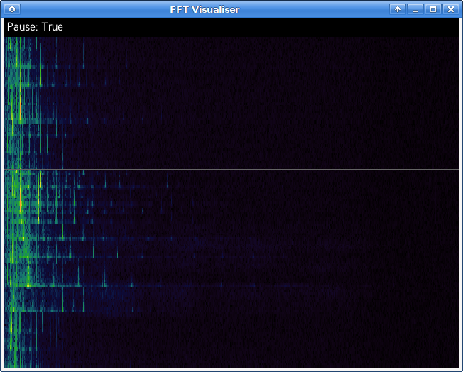

livefft
=========

Real-time spectrum analyser in Python

Introduction
------------
A basic spectrum analyser which reads data from the default ALSA input device and displays the time history and spectrum in real time.

Adapted from [Rick Lupton](https://github.com/ricklupton)'s [livefft](https://github.com/ricklupton/livefft).  Many thanks for all his hard work.

Dependencies
-------------

 * SDL2, and SDL-ttf packages
 * Python 3+
 * Python packages listed in [requirements.txt](requirements.txt)

Installation
------------

### Arch Linux

 * SDL: `pacman -S sdl2_ttf sdl2`
 * Tool using pip: `pip install livefft-sdl`

### Ubuntu

 * SDL: `apt install libsdl2-dev libsdl2-ttf-dev`
 * Tool using pip: `pip3 install livefft-sdl`

Usage
------

### Run after installation from pip

Simply run this from your terminal:

    livefft-sdl

### Running locally

 1. Do whatever setup for virtualenvs you usually use
 2. Clone the repository (see the green clone button in github or ask your friendly neighborhood developer)
 3. `pip install -r requirements.txt`
 4. `python livefft-sdl.py`

### Keyboard shortcuts

 - ESC: Quit
 - `P`: pause
 - `S`/`D`: Speed up or slow down the scanning speed
 - `C`/`V`: Increase/decrease the colour offset --- how far around the colour wheel the base colour is
 - `Z`/`X`: Increase/decrease the colour range --- the amount by which the colour varies according to frequency density
 - `M`: Toggle party mode.  Slowly scrolls around the base colour.  Scroll speed is based on the range size, so it scrolls faster if the colour range is large (i.e. unicorn vomit mode)
 - `Q`/`W`: Show more or less of the FFT range, i.e. cut off higher frequencies
 - `L`: Show/hide clock

The time signal is shown in the top plot, the spectrum below.

Known Issues
------------

 * There's no way of choosing audio input.  Using a mixer to select the default one works well if you're using pulseaudio.
 * If you make the screen wider than the FFT, the renderer will leave gaps in the output (drawing vertical black lines on the plot).  This is pretty unlikely in practice and I don't intend to fix it
 * Everything's done on one core, and SDL's rendering is so slow in software mode that it's basically paced by your CPU.  Some perf improvements might occur as I try to run this on lesser hardware.
 * The clock format is UK-based and hardcoded because for some reason python didn't want to pick up on my locale.  Tough shit if you live somewhere that likes silly date orders :-)

### TODO List

 * Ability to change the FFT buffer length
 * Calibration of the FFT's frequency range, and maybe tick marks on the plot to show particular frequencies
 * Calibration of the FFT's gain.  Ability to adjust gain on-the-fly
 * The ability to monitor two audio streams, switching between them as one stops
 * The ability to set/change render resolution so slow devices can render at half-res
 * GPGPU FFT
 * GPGPU FFT on a raspberry pi
 * Reading email :-P

Contact
-------
Please [get in touch](https://stephenwattam.com/contact) if you have any ideas/suggestions/wants/thanks/offers of sexual favours.
